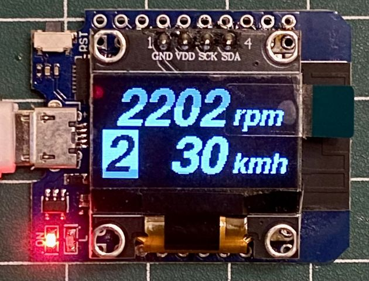
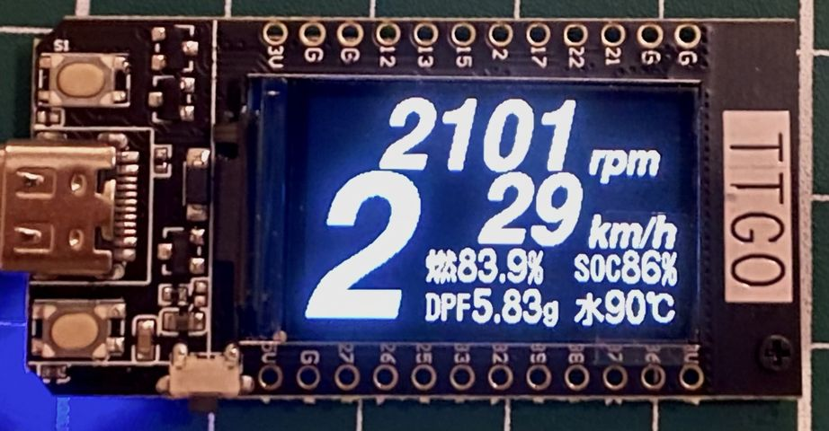
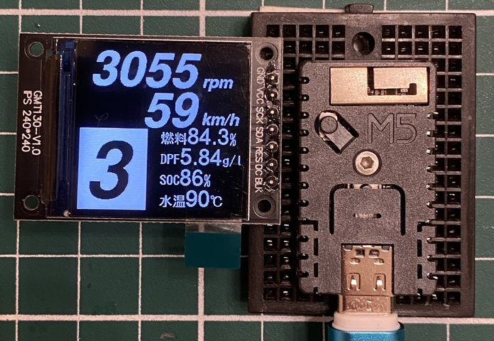
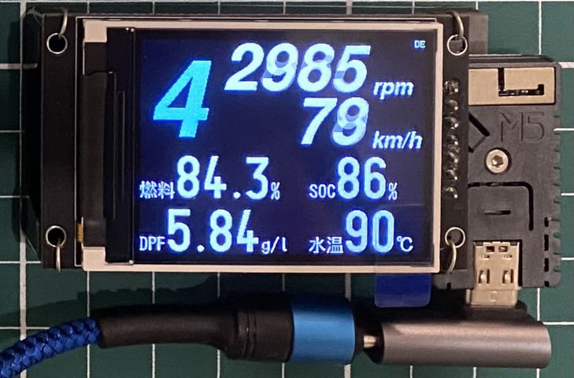
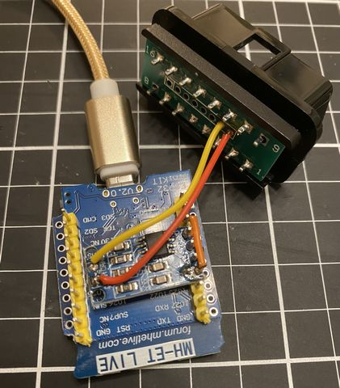
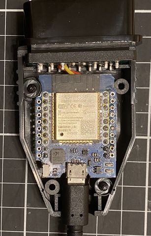
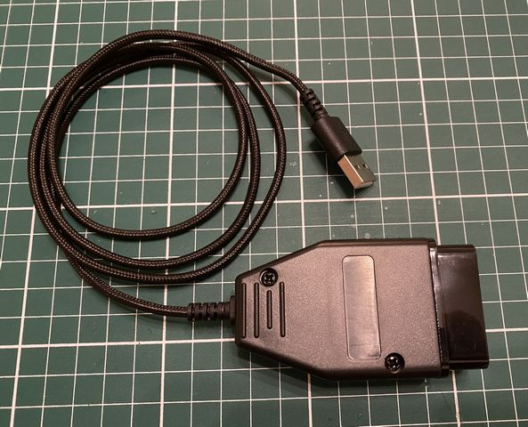

# Can_ShiftIndicator

# 目的

OBD2で電源を取るレーダー探知機の補器として機能し、レーダー探知機で取得していない情報を表示することを目的とします。<BR>
<BR>
電源に使用されているCOMTEC OBD2-R2のOBD2接続アダプターは、車両の情報表示のために、定期的に回転数や車速をPIDで問い合わせを行っています。<BR>
これを利用して小型ディスプレイにシフトポジションを表示したかったのが、このプロジェクトの始まりです。<BR>
<BR>
さらに、レーダー探知機で問い合わせが行われない情報を得るため、登録されたPIDを定期的に送信して表示を行います。<BR>

# システム構成

システム構成は以下の通りです。<BR>
```
OBD2 - CANトランシーバ - ESP32(*1) - WiFi === (WiFi - ESP32(*2) - Display)
 |                        |
 +- (OBD2-R2相当)         +- (Display)

※便宜的にWiFiと記載していますが、ESP-NOWを使用しています
```
システム内には１台もしくは２台のESP32が必要です。<BR>
２台目はディスプレイまでの配線を無線化したい場合に必要となります。<BR>
1. CAN機能あり： ESP32 + CANトランシーバ + （ディスプレイ：2台構成の場合は不要）
2. CAN機能なし。表示専用： ESP32 or ESP32-C3 + ディスプレイ

※ *1のESP32にESP32-C3等を利用できません（ArduinoのCANライブラリが対応していないため）<BR>
※ OBD2-R2が接続されているCAN上に配置するので、別途OBD2分岐ケーブルが必要です。<BR>
※ OBD2-R2を使用しない場合は、「調整」の項目を参考に自発的に送信を行う改造をしてください。<BR>

# プロジェクト説明

## 機能概要

ソースコードは、システム構成の*1,*2どちらにも対応するように出来ています。<BR>
CANの受信を検知すると、WiFi上にブロードキャストにOBD2データを送信します。（無線の課題については、後述の「注意」を参照ください。）<BR>
CANもしくはWiFiで受信したOBD2のPIDを解析し、ディスプレイに表示を行います。<BR>
CAN受信が発生した場合のみ、登録されたPIDを定期的にCAN送信します。<BR>

## ハードウェア構成

### ESP32とディスプレイ

以下のESP32とディスプレイの接続を想定しています。<BR>
左のマクロ名は、define.hのboard selectで定義しています。使用する構成のみを有効にして下さい。<BR>
| define | description |
|-|-|
| D1mini_ESP32    | MH-ET LIVE MiniKit for ESP32 + SSD1306 0.96inch 128x64(I2C) |
| LILYGO_TDisplay | LILYGO T-Display MIC                                        |
| M5STAMPC3_13    | M5Stamp C3 Mate + ST7789 1.3inch 240×240(SPI) 7pin(CSなし)  |
| M5STAMPC3_20    | M5Stamp C3 Mate + ST7789 2.0inch 240×320(SPI) 7pin(BLKなし) |

下記は、２台目のESP32の接続例になります。<BR>
配線を容易にするために、直結しています。他に接続するデバイスが無ければ動作すると思いますが、レギュレータの容量に注意してください。<BR>
|D1mini_ESP32|LILYGO_TDisplay|M5STAMPC3_13|M5STAMPC3_20|
|------------|---------------|------------|------------|
|||||

ディスプレイとのピン接続を変更する場合は、display_app_xxx.cpp の各ファイルにある、DISP_xxx の定義を変更してください。<BR>

### CANトランシーバ

CANトランシーバとの配線を変更する場合は、can_app.cpp の、CAN_RX_PIN, CAN_TX_PIN の定義を変更してください。<BR>
<BR>
CANトランシーバは、3.3VIOが使用できるMCP2562が良いですが、手元になかったので、TJA1050を使用しました。<BR>
__下記写真の例は、TJA1050と直結(VCCだけ下のピンを抜き配線している)しているため、マネしないでください。__<BR>
__出力がTJA1050の定格を下回っていたり、5Vが入力されてESP32が破損する可能性があります。（実際、4台中2台が動作しませんでした。）__<BR>
レベルシフタを挟むか3.3VIO対応のCANトランシーバを使用するようにしてください。<BR>
||||
|-------------------|-------------------|-------------------|

### SW

スイッチはオンボードSWを想定しています。<BR>
短押しで、輝度を変更し、<BR>
長押しで、下記のようなレイアウト確認用のデモ表示を行うことができます。<BR>

https://user-images.githubusercontent.com/96818632/189882163-87d328f5-ae64-43de-8342-e06056138896.mp4

### 電源

上記で紹介した構成では、ESP32の電源をUSBから取得しています。<BR>
<BR>
OBD2には12Vが来ていますが、常時電源のため注意が必要です。<BR>
14V以上の電圧検知でESP32を駆動し、暗電流が低い回路を作れれば、接続したまま無線化を実現できそうです。<BR>
下記サイトの基板であれば、これを実現できているかもしれません。<BR>
https://github.com/MagnusThome/RejsaCAN-ESP32

## 調整

車両や回路の構成に応じて以下の変更を行ってください。<BR>

### シフトポジションの算出

ギア比の求め方については、下記サイトなどを参考にしてください。<BR>
https://nikawa-niwaka.net/entry/386#toc7<BR>
<BR>
車の諸元表等で、以下のパラメータを確認して、それぞれの変数の値を変更してください。<BR>
tireround : タイヤ円周<BR>
finalratio : 最終減速比<BR>
gearratio[] : 変速比<BR>

### CAN送信の登録と送信間隔

期待するPIDをCANで受信すると、OBD2側のESP32と判断してCAN送信を始めるようにしています。<BR>
OBD2-R2を使用しないときなど、無条件にCAN送信を行う場合は、CAN2WiFibridge の初期値を true にする必要があります。<BR>
<BR>
送信対象のPIDの変更を行う場合は、set_canbuf[]に設定している処理を変更する必要があります。<BR>
__特に、本プログラムではVehicle specificのPIDを使用しているため、実際に利用可能なPIDに変更してください。__<BR>
<BR>
送信間隔は、cmd_countの判断方法を変更すれば調整可能ですが、実車に影響のないバス負荷とする必要があります。<BR>
参考までに、OBD2-R2の場合は、回転数、車速を100～200ms周期で出しています。<BR>

### WiFi設定と送信間隔について

WiFiのパケットは、効率化のためOBD2の複数のフレームをまとめて（OBD2PKT_NUM数分）送ります。<BR>
送信間隔は5msで、この辺りがESP-NOWで正常に動作できる限界のようです。<BR>
（CANの送信間隔から、ここまでのスループットは必要ありませんが、応答性を重視して早くしています。）<BR>

## 注意

スケッチの構成を同一にするため、ESP-NOWはブロードキャストで送信を行っています。そのため、セキュリティの面で良くないです。<BR>
さらに、高速で通信しているためいるため、無線環境への影響が考えられます。<BR>
送信対象のMACアドレスを限定したり、見られたくない情報は送らないようにするなどの変更を行ってください。<BR>

__CAN宛にデータを送信できる改造を行うと、セキュリティホールを作りこむことになるので危険です。__<BR>

## 参考

https://en.wikipedia.org/wiki/OBD-II_PIDs
